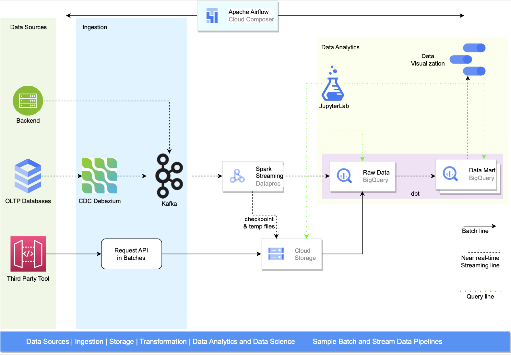
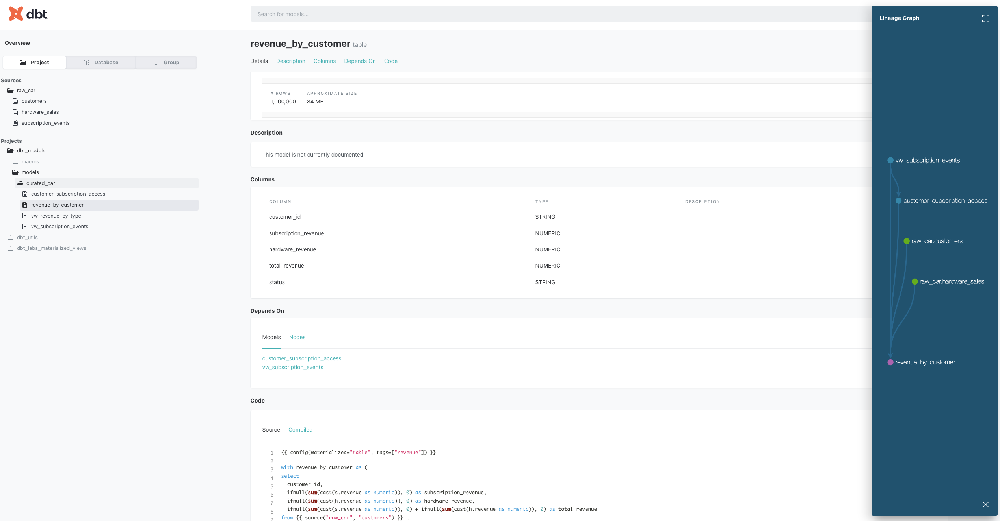
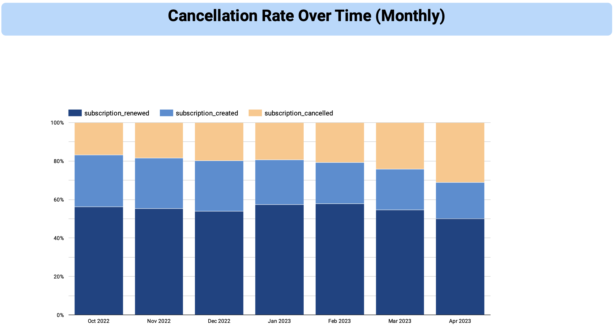

# Car services data pipelines and analytics

This repository shows a demonstration of a near real-time data pipeline from Kafka to BigQuery and data transformations within BigQuery via dbt.


## High level data pipeline architecture



## Data modeling and analytics
SQL transformation queries are managed by dbt in [dbt_models](dbt_models)

[dbt][dbt] provide some highlight features:
- Data quality with testing
- Snapshot data (SCD Type 2)
- Reusable and modular code with Jinja
- Integration with Git and CI/CD process
- Data documentation including data lineage



## [Data visualization](./media/Subscription_Hardware_Sales_Performance.pdf)



## Project development and coding convention
This project is using [Poetry][poetry] for dependency management and packaging. e.g:
```shell
poetry add types-pytz
poetry show --latest
poetry update
```

In order to ensure the quality of the project, we use following libraries:
- black: The uncompromising Python code formatter
- isort: Utility to sort imports alphabetically, and automatically separated into sections and by type
- flake8: Tool for style guide enforcement and code linter
- mypy: Optional static typing for Python
- pydocstyle: Static analysis tool for checking compliance with Python docstring conventions
- pre-commit: A framework for managing and maintaining pre-commit hooks

Inorder to install pre-commit in your development environment, execute following commands
```shell
pre-commit run --all-files
pre-commit install
```

For more details of the libraries versions, coding convention configuration, please take a look at [pyproject.toml](pyproject.toml) and [.pre-commit-config.yaml](.pre-commit-config.yaml)


## References


<!-- links -->
[dbt]: https://github.com/dbt-labs/dbt-core
[poetry]: https://github.com/python-poetry/poetry
